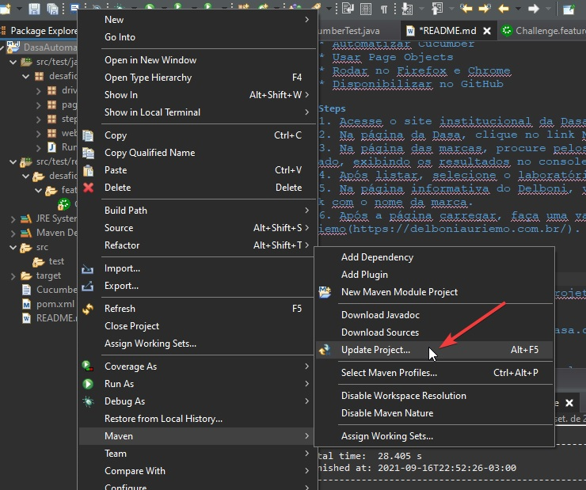
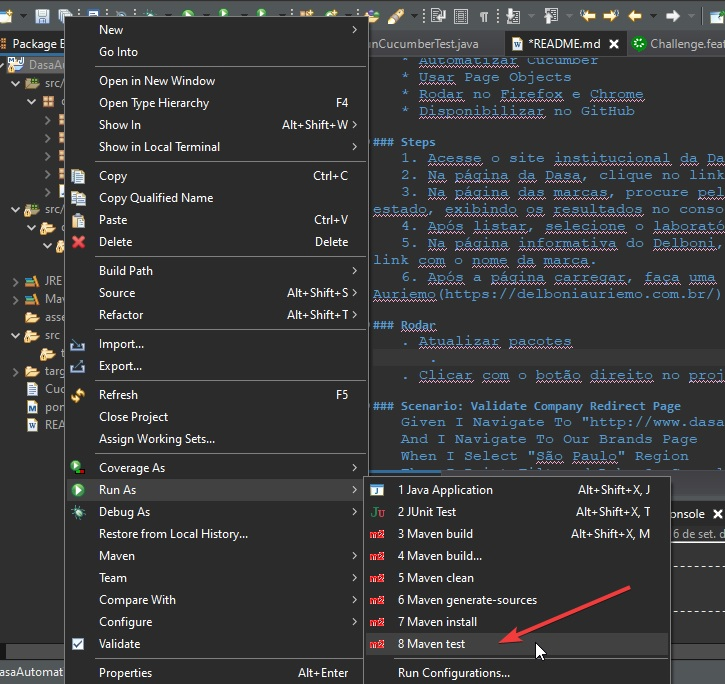

# Desafio Dasa - Jornada Paciente

## Automação de Testes - QA

### Requisitos
	* Utilizar BDD
	* Automatizar Cucumber
	* Usar Page Objects
	* Rodar no Firefox e Chrome
	* Disponibilizar no GitHub

### Steps
	1. Acesse o site institucional da Dasa(https://dasa.com.br/).
	2. Na página da Dasa, clique no link Nossas Marcas.
	3. Na página das marcas, procure pelos laboratórios de São Paulo e liste todos os laboratórios do estado, exibindo os resultados no console.
	4. Após listar, selecione o laboratório DelboniAuriemo.
	5. Na página informativa do Delboni, valide que acessou a área do laboratório e em seguida clique no link com o nome da marca.
	6. Após a página carregar, faça uma validação que foi direcionado corretamente para o site do Delboni Auriemo(https://delboniauriemo.com.br/).

### Configurações do projeto
	1. Atualizar projeto

	2. Clicar com o botão direito no projeto rodar como Maven Test

### Scenario: Validate Company Redirect Page
	Given I Navigate To "http://www.dasa.com.br"
	And I Navigate To Our Brands Page
	When I Select "São Paulo" Region 
	Then I Print Filtered Labs On Console
	When I Select "delboniauriemo.com.br" Lab
	Then I Verify If I Navigated To "https://delboniauriemo.com.br/"
 
--- 
